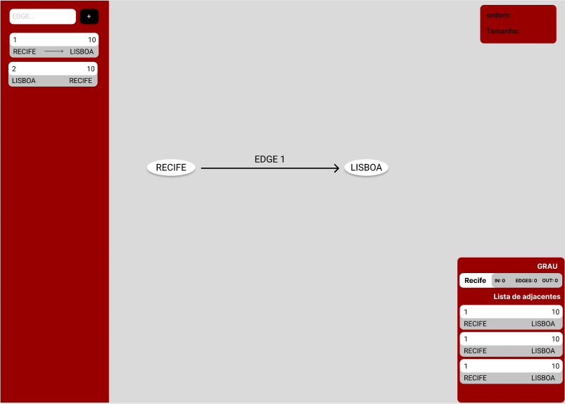
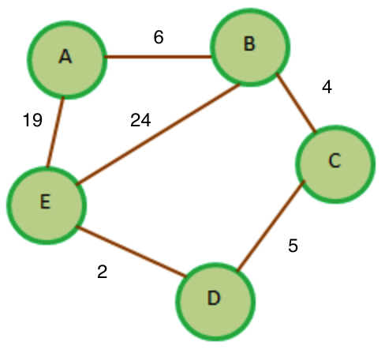

# Graph-tool an graph-oriented blockchain project

# The Stellar  Group

## Members

- José Cláudio Soares Neto(jcsn@cesar.school) → Back-end Developer
- Pedro Barbosa(pb@cesar.school) → Front-end Developer
- Giovanni Netto Procida(gnp@cesar.school) → Front-end Developer

## Roadmap

- [x]  Implement a software that can interpret a graph
    - [x]  Front-end
    - [x]  Back-end
        - [x]  Create, update and delete a graph
        - [x]  Graph operations
        - [x]  Graph minimum cost path algorithms(Dijkstra)
- [ ]  Graph-oriented blockchain
	- [x]  Network Concept
    - [ ]  Blocks implementation
    - [ ]  Proof-of-Stake implementation

# First Implementation

## Timeline

## 04/04(Sunday) → 3h

Before we started the activity it was discussed whether the group would want an application using Front-end, with everyone in favor of it, the group was divided into two, where two members would be responsible for the Back-end application and two for the Frontend. Before starting the code, it was decided which technologies would be used, for the frontend it was chosen used to React JS and for the backend, it would be Python. With that, an initial environment for both applications was created, as well as a repository on Github for a better version of the code with a branch for each application.

Back-end → It was initially studied how the graph algorithm implementation works, choosing to use an implementation using adjacent lists.

Front-end → A quick search was made to find a library for better visualization and implementation of graphs, choosing VisJS. In addition to the initial code creation

## 17/04(Saturday) → 3h

With the leaving of one of the group members, a brief discussion was made of how the division of the activity's work would be from that moment on, so it was decided that everything that had already been decided and done would be maintained, but only one member would be left with the Back-end, receiving support from the other two members who would be responsible for the Front-end. To test each application, mocks were used throughout the process, while the integration was not carried out.

Backend → Initialization of the construction of the graph and vertex classes.

Frontend:

- Creation of a low-fidelity prototype using Figma, to better visualize how the solution would look in the end.

- Beginning of the discussion on how the user's input would be, in addition to aligning how the request and response part would be between the applications.

## 19/04(Monday) → 5h

Back-end → Finalization of the graph class and final tests, in addition to starting to create the API to integrate the applications.
Front-end → I finish the discussion of how the user input would be done, finalization of the rest of the components, and the styling part.

## 20/04(Tuesday) → 3h

We started writing documentation for both applications. The whole part of the Back-end was done, so it was decided to successfully integrate the Front-end and Back-end.

## 22/04(Thursday) → 4h

Finalization of the documentation, front-end and bug fixes.

# Second Implementation

## Activities Table
imagem da tabela(atividades.png)

Backend Code - Implementing the code for the dijkstra algorithm in the backend

Frontend Layout - Thinking about redesigning the frontend layout and how the new features would be implemented

imagem do layout(layout.png)

Frontend Code - Implementing code for the new layout and dijkstra algorithm for frontend

Intregation - Implement backend and frontend integration

Tests - Time spent for:
1) Test the functioning of the dijkstra algorithm on the backend, making the test with more than one example of graphs.
2) The operation of the new frontend layout in addition to the use of a mock to evaluate the operation of the djkstra algorithm by the frontend.
3) Testing the backend and frontend integration.

Documentation - Working on the document

## Dijkstra Algorithm

### About
Dijkstra's Algorithm is used to find the shortest path between nodes in a graph. Particularly, you can find the shortest path from a node (called the "source node") to all other nodes in the graph, producing a shortest-path tree. Dijkstra's Algorithm can only work with graphs that have positive weights. This is because, during the process, the weights of the edges have to be added to find the shortest path. If there is a negative weight in the graph, then the algorithm will not work properly. Once a node has been marked as "visited", the current path to that node is marked as the shortest path to reach that node. And negative weights can alter this if the total weight can be decremented after this step has occurred. The algorithm consists of the following steps:

1)Initialization of all nodes with distance "infinite";initialization of the starting node with 0
2)Marking of the distance of the starting node as permanent, all other distances as temporarily.
3)Setting of starting node as active.
4)Calculation of the temporary distances of all neighbour nodes of the active node by summing up its distance with the weights of the edges.
5)If such a calculated distance of a node is smaller as the current one, update the distance and set the current node as antecessor. This step is also called update and is Dijkstra's central idea.
6)Setting of the node with the minimal temporary distance as active. Mark its distance as permanent.
7)Repeating of steps 4 to 7 until there aren't any nodes left with a permanent distance, which neighbours still have temporary distances.

### Pseudo Code
function Dijkstra(Graph, source):
  for each vertex v in Graph:	// Initialization
    dist[v] := infinity	// initial distance from source to vertex v is set to infinite
    previous[v] := undefined	// Previous node in optimal path from source
  dist[source] := 0	// Distance from source to source
  Q := the set of all nodes in Graph	// all nodes in the graph are unoptimized - thus are in Q
  while Q is not empty:	// main loop
    u := node in Q with smallest dist[ ]
    remove u from Q
    for each neighbor v of u:	// where v has not yet been removed from Q.
      alt := dist[u] + dist_between(u, v)
      if alt < dist[v]	// Relax (u,v)
        dist[v] := alt
	previous[v] := u
  return previous[]
  
the Complexity of the dijkstra algorithm is O(o^2)

# About the project

This is a project of CESAR School University that aims to implement a tool that is capable of creating a graph and executing graph operations functions.
The students that developed this project are highly interested in blockchain technology, so the team started to think about how could integrate this project with our objectives of learning more of blockchain.
Until now, we had developed a software that is capable of interpreting and operate a graph using adjacency list, and in the future, we probably will implement algorithms like the Dijkstra algorithm.
Having that in mind, since we are interested in blockchain technology we will try to build a graph-oriented proof-of-work blockchain. 

# Plans for the future

For the near future as said before we plan to implement the base of a blockchain that the transactions are graph-oriented. We brainstormed that each block should be a ramdom generated graph with different cost edges, the worker that find the less cost path to the transaction will validate it.

For example let's sai that we have the graph below:

The path that we want to reach is E → A, so the less costly path is E → D → C → B → A. So the worker that finds this path first will validate the transaction. Keep in mind that is a simple example and can be way more complex as the graph grows.

## Network Concept

For the network rules, we decided to use a delegated proof-of-stake as consensus mechanisms.  That means that owners can delegate their tokens to validators, to become a validator you need to hold a minimum amount of tokens that can be or not delegated to you, as the network grows that amount increase accordingly.

The network will initially use 1-5-1 validation:
1 -> A graph will be generated by this validator using a pre-defined algorithm by the network and 2 vertices will be randomly chosen to find the costless path.

5 -> Five validators will be picked to find the path, all of them had to find the path using their algorithms, resources, thread management, and so on. They are free to use any algorithm to figure out the costless path.

1 -> After the previous 5 validators submit their answer to the graph, the final one will call voting to validate which costless paths are correct.
When a consensus is reached, the current validator can do the minting of the block.
Those validators who agreed in a consensus will be rewarded accordingly their throughput time, also the ones that created the graph and minted the block.
